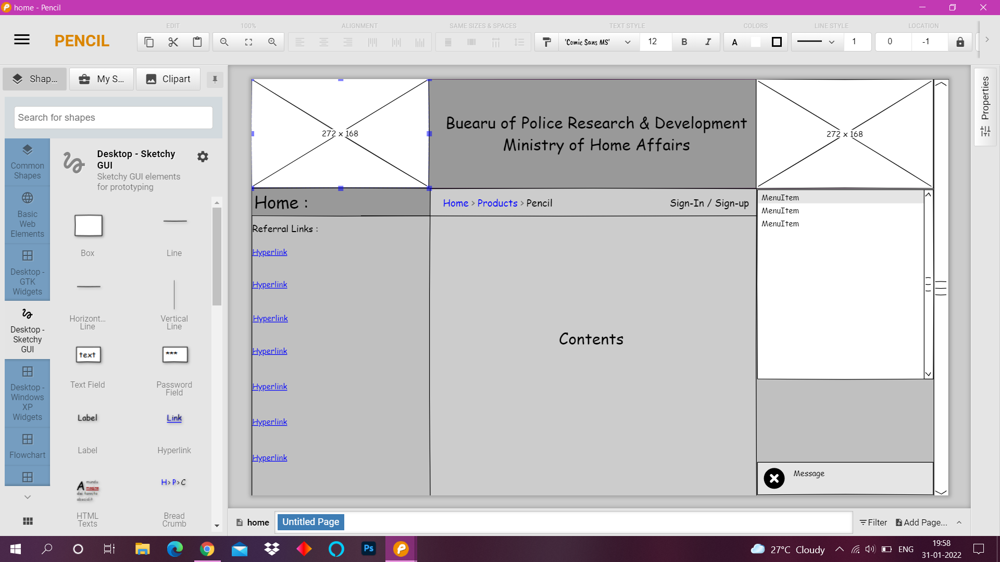
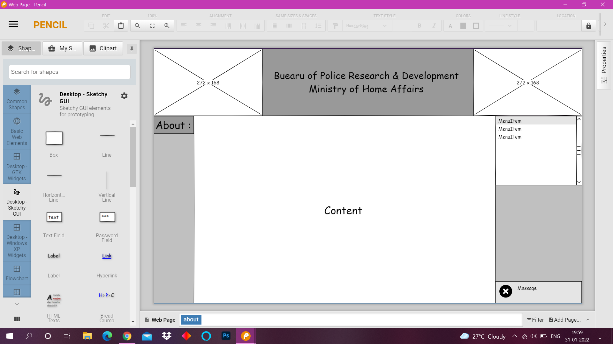
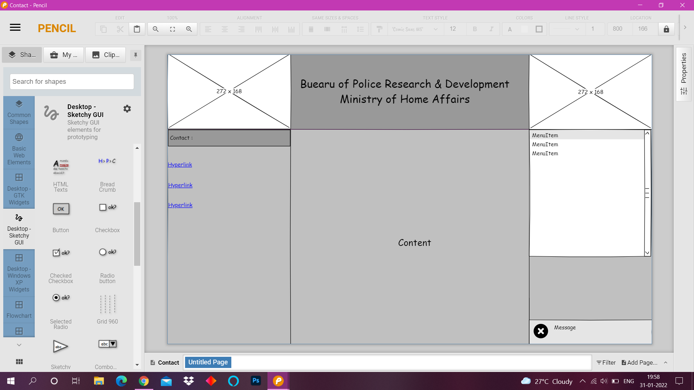

# Wire frame for a website

## AIM:
To design a wire frame for a website.

## DESIGN STEPS:

### Step 1:
Create file in pencil project software.Design your wire frame project.

### Step 2:
Save the file and Submit.

## OUTPUT:
Home Page:

About Page:

Contact Page:

## Result:
Thus a wire frame is designed for a given website.
